# Pick-and-Place Cycle Timeline

Time-based timeline of one cycle starting at `t = 0 ms` (start trigger received).
Times are computed from configured speeds (constant-velocity model — actual times are slightly longer due to accel ramps).

Speed reference:
- X: `6000 steps/sec` (max), `800` (homing) · Z: `10000` (max), `15000` (dropoff lower), `450` (re-home in dropoff)
- `STEPS_PER_INCH ≈ 254`

State transitions: **PICKUP → TRANSPORT @ 395 ms · TRANSPORT → DROPOFF @ 1463 ms · DROPOFF → IDLE @ ~2880 ms** · then ≥ 2000 ms inter-cycle delay.

---

## Time-based Gantt (X axis = ms)

```mermaid
gantt
    title Pick-and-Place — one cycle (X axis = milliseconds)
    dateFormat  x
    axisFormat  %L

    section State
    PICKUP                     :crit, st1, 0,    395
    TRANSPORT                  :crit, st2, 395,  1068
    DROPOFF                    :crit, st3, 1463, 1417
    IDLE (≥2 s inter-cycle)    :       st4, 2880, 2000

    section X axis
    Idle at 0.2" (pickup)              :xa, 0,    395
    Move 0.2" → 23.15" overshoot       :active, xb, 395,  971
    Reverse 23.15" → 20.85" dropoff    :active, xc, 1366, 97
    Hold at dropoff (waits Z + delays) :       xd, 1463, 204
    Return 20.85" → 0.2" pickup        :active, xe, 1667, 874
    Re-home to X switch (slow)         :crit,   xf, 2541, 64
    Move to pickup 0.2"                :active, xg, 2605, 9

    section Z axis
    Lower 0.3" → 6.35" pickup          :active, za, 0,    154
    Hold (PICKUP_WAIT 100 ms)          :       zb, 154,  100
    Raise 6.35" → 0.8" transport       :active, zc, 254,  141
    Hold at 0.8" (during X overshoot)  :       zd, 395,  971
    Lower 0.8" → 6.65" dropoff (15k)   :active, ze, 1366, 99
    Vacuum delay 50 ms                 :       zf, 1463, 50
    Wait 10 + Settle 25                :       zg, 1513, 35
    Raise 6.65" → 2.0" (10k)           :active, zh, 1548, 118
    Re-home to Z switch (slow 450)     :crit,   zi, 1666, 1131
    Move to Z_HOME 0.3"                :active, zj, 2797, 8

    section Servo
    52° pickup pos                     :sa, 0,    301
    32° travel (1/3 up Z raise)        :sb, 301,  883
    110° dropoff (2" before dropoff)   :sc, 1184, 483
    52° home (Z passes 2")             :sd, 1667, 1213

    section Vacuum
    OFF                                :va, 0,    94
    ON (Z reaches 4.0")                :crit, vb, 94,  1369
    OFF (at dropoff)                   :vc, 1463, 1417

    section STAGE2_SIGNAL
    LOW                                :ga, 0,    1667
    HIGH                               :crit, gb, 1667, 874
    LOW                                :gc, 2541, 339
```



---

## Time-based ASCII timeline (1 char ≈ 50 ms)

```
 t (ms):    0      250     500     750    1000    1250    1500    1750    2000    2250    2500    2750
            |───────|───────|───────|───────|───────|───────|───────|───────|───────|───────|───────|
 STATE      ├── PICKUP ────┤├──────────── TRANSPORT ────────────┤├──────────────── DROPOFF ──────────────┤── IDLE
                       395│                                   1463│                                   2880│

 X axis     [ idle 0.2" ]   [══════ move 0→23.15" overshoot ═════][rev][══ hold ══][═══ return 20.85→0.2" ═══][reH][p]
                                                                  1366 1463       1667                      2541

 Z axis     [══ lower ══][hold][═ raise ═][═══════════ hold @ 0.8" ════════════][═ lower ═][vd][ws][═ raise ═][════════ Z re-home (slow 450) ════════][m]
             0        154     254       395                                    1366       1463 1513 1548  1666                                     2797

 Servo      [═ 52° pickup ═]  [════════ 32° travel ════════]  [════ 110° dropoff ════]  [════════ 52° home ═════════ ...
              0           301                              1184                       1667

 Vacuum     [OFF][═══════════════════════════ ON ═════════════════════════════][════════════════════ OFF ════════════════════
              0  94                                                          1463

 STAGE2     [══════════════════ LOW ═════════════════════════════════════════════════][════ HIGH ════][══ LOW ══ ...
              0                                                                     1667             2541
```

---

## Event table

| t (ms) | State          | Event                                                              | Source |
|-------:|----------------|--------------------------------------------------------------------|--------|
|     0  | **→ PICKUP**   | Start trigger; servo → 52° (pickup); Z begins lowering 0.3 → 6.35" | `02_PICKUP.cpp:66,74` |
|    94  | PICKUP         | Vacuum **ON** (Z reaches 4.0")                                     | `02_PICKUP.cpp:76-78` |
|   154  | PICKUP         | Z reaches 6.35" → begin 100 ms hold                                | `02_PICKUP.cpp:86` |
|   254  | PICKUP         | Z begins raising 6.35 → 0.8"                                       | `02_PICKUP.cpp:88` |
|   301  | PICKUP         | Servo → 32° (travel) at 1/3 of raise                               | `02_PICKUP.cpp:97-99` |
|   395  | **→ TRANSPORT**| Z at 0.8"; X begins moving 0.2 → 23.15" overshoot                  | `03_TRANSPORT.cpp:61` |
|  1184  | TRANSPORT      | Servo → 110° (dropoff) at X = 18.85"                               | `03_TRANSPORT.cpp:69-71` |
|  1366  | TRANSPORT      | X at overshoot; reverse to 20.85" + Z lowers 0.8 → 6.65" @ 15k     | `03_TRANSPORT.cpp:75-82` |
|  1463  | **→ DROPOFF**  | X at dropoff; vacuum **OFF**; begin 50 ms vacuum delay             | `04_DROPOFF.cpp:82-89` |
|  1513  | DROPOFF        | 10 ms hold                                                          | `04_DROPOFF.cpp:98` |
|  1523  | DROPOFF        | 25 ms settle                                                        | `04_DROPOFF.cpp:104` |
|  1548  | DROPOFF        | Z begins raising 6.65 → 0.3" @ 10k                                  | `04_DROPOFF.cpp:106-108` |
|  1666  | DROPOFF        | Z passes 2.0" → servo → 52°, **STAGE2 HIGH**, X returns 20.85 → 0.2", Z `forceStop` + slow re-home | `04_DROPOFF.cpp:118-130` |
|  2541  | DROPOFF        | X at pickup-return                                                  | `04_DROPOFF.cpp:151` |
|  2797  | DROPOFF        | Z home switch hit → set 0, move to 0.3"                             | `04_DROPOFF.cpp:142-148` |
|  2805  | DROPOFF        | Both motors at target; **STAGE2 LOW**; X re-homes via switch        | `04_DROPOFF.cpp:162-167` |
|  2869  | DROPOFF        | X home switch hit → move to 0.2"                                    | `04_DROPOFF.cpp:175-181` |
|  ~2880 | **→ IDLE**     | Cycle complete; `lastCycleEndTime` recorded                         | `main.cpp:189-191` |
|  +2000 min | IDLE       | Earliest next cycle start (inter-cycle delay)                       | `main.cpp` |

---

## Notes on timing accuracy

- All durations assume constant velocity. Real cycle is slightly longer because of accel ramps (`X_ACCEL = 10000`, `Z_ACCEL = 10000`).
- The Z re-home segment (1666 → 2797 ms, ~1.1 s) dominates the post-dropoff phase because `Z_HOME_SPEED = 450 steps/sec`. The X return (~875 ms) finishes earlier and waits.
- The X reverse (1366 → 1463 ms, 97 ms) is the most accel-sensitive — actual time is meaningfully longer than the constant-velocity estimate.
